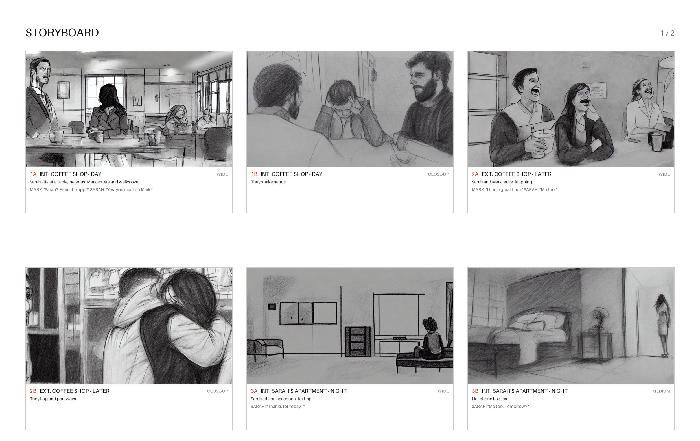

# Script-to-Storyboard Generation System

An AI-powered system that converts film scripts into visual storyboards using NLP, computer vision, and deep learning.

## Features

- Screenplay parsing: scene headings, character cues, dialogue and parentheticals
- One frame per shot: each action paragraph becomes a shot (1A, 1B, ...), with a default camera framing (wide, medium, two-shot, close-up)
- Emotion analysis per shot, used to set the mood of the image
- 16:9 pencil-sketch frames from Stable Diffusion (local) or Gemini (hosted)
- Camera directions in the script (`CLOSE ON`, `WIDE SHOT`, `ANGLE ON`, ...) are respected
- Storyboard sheets as PDF, 6 panels per landscape page
- Web page with live progress, plus a JSON API

## Example Output

Generated from [examples/sample_script.txt](examples/sample_script.txt) with the Stable Diffusion backend:



- Storyboard PDF: [examples/storyboard-example.pdf](examples/storyboard-example.pdf)
- Individual panels: [examples/frame_001.png](examples/frame_001.png) through [frame_007.png](examples/frame_007.png)

## Project Structure

```text
script2storyboard/
├── src/
│   ├── nlp/              # NLP processing modules
│   ├── vision/           # Computer vision and image generation
│   └── api/              # API endpoints and services
├── examples/            # Example scripts and generated storyboard assets
├── tests/               # Unit tests
└── output/              # Generated storyboard outputs
```

## Setup

1. Create and activate a virtual environment:
```bash
python -m venv venv
venv\Scripts\activate
```

2. Install dependencies:
```bash
pip install -r requirements.txt
```

3. Download the spaCy model if needed:
```bash
python -m spacy download en_core_web_lg
```

4. **If you have an NVIDIA GPU**, install the CUDA build of PyTorch. The default `pip install torch` on Windows is CPU-only, so Stable Diffusion takes minutes per frame instead of seconds:
```bash
pip install torch==2.13.0 --index-url https://download.pytorch.org/whl/cu126
```
Check it worked with `python -c "import torch; print(torch.cuda.is_available())"`. It should print `True`. A 4 GB laptop GPU (RTX 3050 Ti) draws a frame in about 8 seconds. On CPU the same frame takes about 3 minutes. On cards under 8 GB the models are offloaded to RAM when not in use, so they fit.

## Usage

Run the generator with any script file:

```bash
python src/main.py --script path/to/script.txt
```

The generated storyboard PDF will be written to the output folder.

Options:

- `--backend auto|stable-diffusion|gemini|fallback`: image backend. `auto` tries Stable Diffusion, then Gemini. `gemini` (also accepted as `nano-banana`, Google's name for the same model) needs `GEMINI_API_KEY`. `fallback` draws empty placeholder frames, so the storyboard layout and captions still work with no model.
- `--output DIR`: output folder (default `output`).
- `--no-open`: don't open the PDF when done.

Environment variables (can go in a `.env` file):

- `GEMINI_API_KEY`: enables the Gemini backend.
- `SD_MODEL_ID`: a different Stable Diffusion 1.5 checkpoint.
- `SD_SEED`: base seed (default 42). Shot N uses seed + N, so a run is reproducible but shots in the same place do not come out as copies of each other.
- `SD_REFERENCE_STRENGTH`: experimental. Uses each scene's first frame as an IP-Adapter reference for its other shots (e.g. `0.3`), which keeps the place and people more alike but also copies the composition, so close-ups tend to come out wide. Off by default. Turning it on downloads a 2.5 GB image encoder once.

How a script becomes frames: each scene heading (`INT.` / `EXT.`) starts a scene, and each paragraph of action inside it starts a shot. Dialogue belongs to the shot it follows. The image prompt describes only what the camera sees (location, framing, action, mood), which keeps it within Stable Diffusion's 77-token limit. The dialogue goes in the caption under the frame.

### API

```bash
uvicorn src.api.main:app
```

Open http://127.0.0.1:8000 for the upload page. Pick a script, watch the frame-by-frame progress, and the PDF downloads when it's done.

Endpoints (scripts are sent as a multipart `file` upload):

- `POST /analyze-script`: the scene and shot analysis as JSON.
- `POST /jobs`: queues a storyboard and returns `{"id", "status", "done", "total"}`. Poll `GET /jobs/{id}`, then fetch `GET /jobs/{id}/pdf`. Jobs run one at a time and are kept for an hour.
- `POST /generate-storyboard`: the same in one blocking request that returns the PDF.

`STORYBOARD_BACKEND` picks the API's image backend (default `auto`).

### Tests

```bash
python -m unittest tests.test_storyboard_generator tests.test_api
```

The API tests use placeholder frames, so they run in a few seconds without a GPU or API key.

### Windows executable

```bash
pip install pyinstaller
python build.py
```

This produces `dist\Script2Storyboard\Script2Storyboard.exe`. It's a folder build: keep the whole `Script2Storyboard` folder together. It's about 5 GB because it bundles PyTorch with CUDA. Tested: the build runs the sample script on the GPU in about 1.5 minutes. The image and emotion models download on first run, as with the Python version.

## License

MIT License